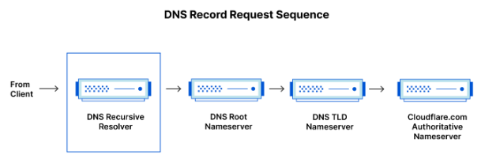

# Qué es DNS?
El Sistema de Nombres de Dominio (DNS) es la guía telefónica de Internet. Los humanos acceden a la información en línea a través de nombres de dominio, como nytimes.com o espn.com. Los navegadores interactúan a través de direcciones IP. El DNS traduce los nombres de dominio a direcciones IP para que los navegadores puedan cargar los recursos de Internet.

Cada dispositivo conectado a Internet tiene una dirección IP única que otras máquinas utilizan para encontrarlo. Los servidores DNS eliminan la necesidad de que los humanos memoricen direcciones IP como 192.168.1.1 (en IPv4), o nuevas direcciones IP alfanuméricas más complejas como 2400:cb00:2048:1::c629:d7a2 (en IPv6).

## ¿Cómo funciona el DNS?
El proceso de resolución DNS consiste en convertir un nombre de host (como www.example.com) en una dirección IP fácil de usar (como 192.168.1.1). A cada dispositivo de Internet se le asigna una dirección IP, que es necesaria para encontrar el dispositivo de Internet adecuado, como la dirección de una calle para encontrar una casa. Cuando un usuario quiere cargar una página web, debe producirse una traducción entre lo que el usuario teclea en su navegador (ejemplo.com) y la dirección amigable para la máquina necesaria para localizar la página web ejemplo.com.

Para entender el proceso que hay detrás de la resolución DNS, es importante conocer los diferentes componentes de hardware entre los que debe pasar una consulta DNS. Para el navegador web, la búsqueda DNS se produce "entre bastidores" y no requiere ninguna interacción por parte del ordenador del usuario, aparte de la solicitud inicial.

## Hay 4 servidores DNS implicados en la carga de una página web:

### DNS Recursor
Se puede pensar en el recursor como en un bibliotecario al que se le pide que vaya a buscar un libro concreto a algún lugar de la biblioteca. El recursor DNS es un servidor diseñado para recibir consultas de máquinas cliente a través de aplicaciones como los navegadores web. Normalmente, el recursor se encarga de realizar peticiones adicionales para satisfacer la consulta DNS del cliente.

### Root nameserver
El servidor raíz es el primer paso en la traducción (resolución) de nombres de host legibles por humanos en direcciones IP. Se puede considerar como un índice en una biblioteca que apunta a diferentes estantes de libros - normalmente sirve como referencia a otras ubicaciones más específicas.

### TLD nameserver
El servidor de dominio de nivel superior (TLD) se puede considerar como una estantería específica de libros en una biblioteca. Este servidor de nombres es el siguiente paso en la búsqueda de una dirección IP específica, y aloja la última parte de un nombre de host (en ejemplo.com, el servidor TLD es "com").

### Authoritative nameserver
Este servidor de nombres final puede considerarse como un diccionario en un estante de libros, en el que un nombre específico puede traducirse en su definición. El servidor de nombres autoritativo es la última parada en la consulta del servidor de nombres. Si el servidor de nombres autoritativo tiene acceso al registro solicitado, devolverá la dirección IP del nombre de host solicitado al Recursor DNS (el bibliotecario) que realizó la solicitud inicial.

## ¿Cuál es la diferencia entre un servidor DNS autoritativo y un resolver DNS recursivo?
Ambos conceptos se refieren a servidores (grupos de servidores) que son parte integral de la infraestructura DNS, pero cada uno desempeña un papel diferente y vive en diferentes lugares dentro de la cadena de una consulta DNS. Una forma de ver la diferencia es que el resolver recursivo está al principio de la consulta DNS y el servidor de nombres autoritativo está al final.

### Recursive DNS resolver
El resolver recursivo es el ordenador que responde a una petición recursiva de un cliente y se toma el tiempo necesario para localizar el registro DNS. Para ello, realiza una serie de peticiones hasta que llega al servidor de nombres DNS autoritativo para el registro solicitado (o se agota el tiempo de espera o devuelve un error si no se encuentra ningún registro). Por suerte, los resolutores DNS recursivos no siempre tienen que realizar varias peticiones para localizar los registros necesarios para responder a un cliente; el almacenamiento en caché es un proceso de persistencia de datos que ayuda a reducir las peticiones necesarias al servir el registro de recursos solicitado antes en la búsqueda DNS.

### Authoritative DNS server
En pocas palabras, un servidor DNS autoritativo es un servidor que realmente posee y es responsable de los registros de recursos DNS. Se trata del servidor situado en la parte inferior de la cadena de búsqueda DNS que responderá con el registro de recursos consultado, permitiendo en última instancia que el navegador web que realiza la solicitud alcance la dirección IP necesaria para acceder a un sitio web u otros recursos web. Un servidor de nombres autoritativo puede satisfacer consultas a partir de sus propios datos sin necesidad de consultar a otra fuente, ya que es la fuente final de verdad para determinados registros DNS.

Vale la pena mencionar que en los casos en que la consulta es para un subdominio como foo.example.com o blog.cloudflare.com, se añadirá un servidor de nombres adicional a la secuencia después del servidor de nombres autoritativo, que es responsable de almacenar el registro CNAME del subdominio.
