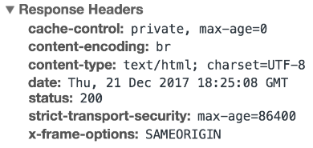

# Que es un nombre de dominio
El Protocolo de Transferencia de Hipertexto (HTTP) es la base de la World Wide Web y se utiliza para cargar páginas web mediante enlaces de hipertexto. HTTP es un protocolo de capa de aplicación diseñado para transferir información entre dispositivos en red y se ejecuta sobre otras capas de la pila de protocolos de red. Un flujo típico a través de HTTP implica que una máquina cliente haga una petición a un servidor, que a su vez envía un mensaje de respuesta.

## ¿Qué contiene una petición HTTP?
Una petición HTTP es la forma en que las plataformas de comunicaciones de Internet, como los navegadores web, solicitan la información que necesitan para cargar un sitio web. Cada petición HTTP realizada a través de Internet lleva consigo una serie de datos codificados que contienen distintos tipos de información. Una petición HTTP típica contiene:
1. HTTP version type
2. a URL
3. an HTTP method
4. HTTP request headers
5. Optional HTTP body.

### Que es un método HTTP?
Un método HTTP, a veces denominado verbo HTTP, indica la acción que la petición HTTP espera del servidor consultado. Por ejemplo, dos de los métodos HTTP más comunes son 'GET' y 'POST'; una petición 'GET' espera información a cambio (normalmente en forma de sitio web), mientras que una petición 'POST' indica normalmente que el cliente está enviando información al servidor web (como información de un formulario, por ejemplo, un nombre de usuario y una contraseña enviados).

### ¿Qué son las cabeceras de petición HTTP?
Las cabeceras HTTP contienen información de texto almacenada en pares clave-valor, y se incluyen en cada petición HTTP (y respuesta, más sobre esto más adelante). Estas cabeceras comunican información básica, como qué navegador está utilizando el cliente y qué datos se están solicitando. Ejemplo de cabeceras de solicitud HTTP de la pestaña de red de Google Chrome:
![[Pasted image 20240813024617.png]]

### ¿Qué hay en el cuerpo de una petición HTTP?
El cuerpo de una solicitud es la parte que contiene el "cuerpo" de la información que la solicitud está transfiriendo. El cuerpo de una petición HTTP contiene toda la información que se envía al servidor web, como un nombre de usuario y una contraseña, o cualquier otro dato introducido en un formulario.

### ¿Qué contiene una respuesta HTTP?
Una respuesta HTTP es lo que los clientes web (a menudo los navegadores) reciben de un servidor de Internet en respuesta a una petición HTTP. Estas respuestas comunican información valiosa basada en lo que se pidió en la solicitud HTTP. 

Una respuesta HTTP típica contiene:

1. Un código de estado HTTP
2. Cabeceras de respuesta HTTP
3. cuerpo HTTP opcional

#### ¿Qué es un código de estado HTTP?
Los códigos de estado HTTP son códigos de 3 dígitos que se suelen utilizar para indicar si una solicitud HTTP se ha completado correctamente. Los códigos de estado se dividen en los 5 bloques siguientes:

1. 1xx Informational
2. 2xx Success
3. 3xx Redirection
4. 4xx Client Error
5. 5xx Server Error

Las "xx" se refieren a diferentes números entre 00 y 99.
Los códigos de estado que empiezan por el número '2' indican un éxito. Por ejemplo, después de que un cliente solicite una página web, las respuestas más habituales tienen un código de estado "200 OK", que indica que la solicitud se ha completado correctamente.
Si la respuesta comienza con un '4' o un '5' significa que se ha producido un error y que la página web no se mostrará. Un código de estado que empiece por '4' indica un error del lado del cliente (es muy común encontrarse con un código de estado '404 NOT FOUND' al cometer un error tipográfico en una URL). Un código de estado que empieza por '5' significa que algo ha ido mal en el lado del servidor. Los códigos de estado también pueden empezar por "1" o "3", que indican una respuesta informativa y una redirección, respectivamente.

#### ¿Qué son las cabeceras de respuesta HTTP?
Al igual que una solicitud HTTP, una respuesta HTTP viene con cabeceras que transmiten información importante como el idioma y el formato de los datos que se envían en el cuerpo de la respuesta. 
Ejemplo de cabeceras de respuesta HTTP de la pestaña de red de Google Chrome:

#### ¿Qué contiene un cuerpo de respuesta HTTP?
Las respuestas HTTP satisfactorias a peticiones "GET" suelen tener un cuerpo que contiene la información solicitada. En la mayoría de las peticiones web, se trata de datos HTML que un navegador traducirá en una página web.